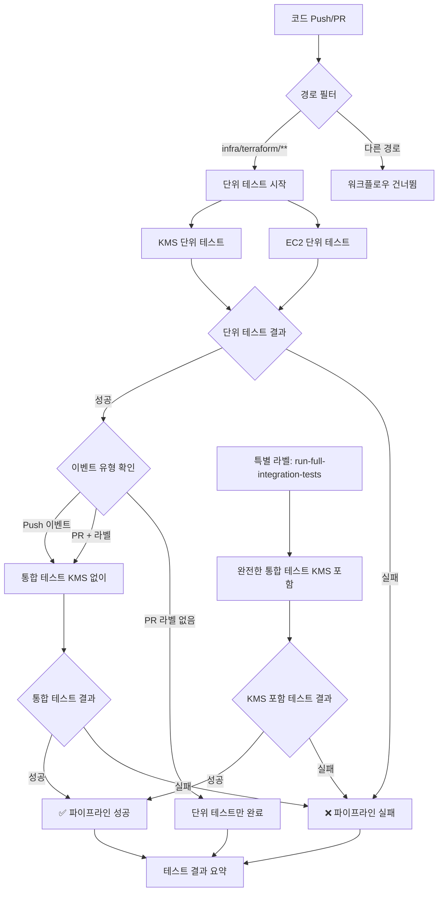
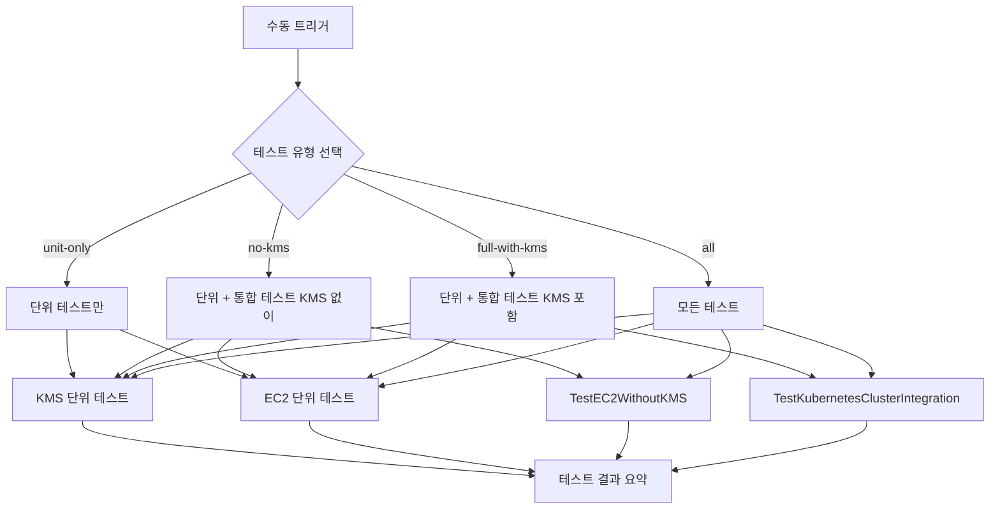
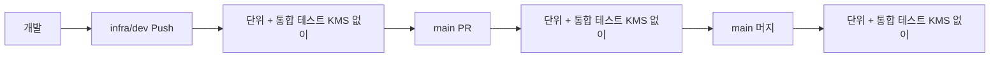
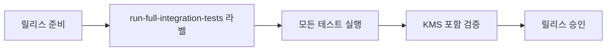

# GitHub Actions 워크플로우

이 디렉토리는 k8s-ec2-observability 프로젝트의 CI/CD 파이프라인을 정의합니다.

## 📋 워크플로우 목록

| 파일 | 설명 | 트리거 |
|------|------|--------|
| `terraform-test.yml` | 자동 테스트 파이프라인 | Push/PR |
| `manual-test.yml` | 수동 테스트 트리거 | 수동 실행 |

## 🔄 자동 테스트 워크플로우 (`terraform-test.yml`)

### 트리거 조건
- **Push**: `main`, `infra/dev` 브랜치
- **Pull Request**: `main` 브랜치로의 PR
- **경로 필터**: `infra/terraform/**` 파일 변경 시

### 워크플로우 다이어그램



### 실행 단계

1. **단위 테스트** (병렬 실행)
   - KMS 모듈 테스트
   - EC2 모듈 테스트
   - 타임아웃: 30분

2. **통합 테스트 (KMS 없이)** - 기본
   - `TestEC2WithoutKMS` 실행
   - 타임아웃: 45분
   - 조건: Push 이벤트 또는 `run-integration-tests` 라벨

3. **통합 테스트 (KMS 포함)** - 선택적
   - `TestKubernetesClusterIntegration` 실행
   - 타임아웃: 60분
   - 조건: `run-full-integration-tests` 라벨

4. **테스트 결과 요약**
   - GitHub Step Summary에 결과 표시

## 🎛️ 수동 테스트 워크플로우 (`manual-test.yml`)

### 트리거 조건
- **수동 실행**: GitHub Actions UI에서 실행
- **입력 파라미터**: 테스트 유형, 환경 선택

### 워크플로우 다이어그램



### 테스트 유형 옵션

| 옵션 | 설명 | 실행 시간 | 권장 용도 |
|------|------|-----------|-----------|
| `unit-only` | 단위 테스트만 | ~5분 | 빠른 검증 |
| `no-kms` | 단위 + 통합 (KMS 없이) | ~8분 | **일반적 사용** |
| `full-with-kms` | 단위 + 통합 (KMS 포함) | ~15분 | 완전한 검증 |
| `all` | 모든 테스트 | ~20분 | 릴리스 전 검증 |

## 🏷️ PR 라벨 사용법

### 자동 테스트 제어
- `run-integration-tests`: PR에서 통합 테스트 (KMS 없이) 실행
- `run-full-integration-tests`: PR에서 완전한 통합 테스트 (KMS 포함) 실행

### 라벨 추가 방법
1. PR 페이지에서 "Labels" 클릭
2. 원하는 라벨 선택
3. 워크플로우 자동 재실행

## 🔧 환경 변수

| 변수 | 값 | 설명 |
|------|----|----- |
| `AWS_DEFAULT_REGION` | `ap-northeast-2` | AWS 리전 |
| `TF_VERSION` | `1.5.0` | Terraform 버전 |
| `GO_VERSION` | `1.21` | Go 버전 |

## 🔐 필요한 시크릿

GitHub 저장소 설정에서 다음 시크릿을 설정해야 합니다:

| 시크릿 | 설명 |
|--------|------|
| `AWS_ACCESS_KEY_ID` | AWS 액세스 키 ID |
| `AWS_SECRET_ACCESS_KEY` | AWS 시크릿 액세스 키 |

## 📊 테스트 전략

### 기본 전략 (권장)


### 완전한 검증 (릴리스 전)


## 🚀 빠른 시작

### 1. 일반적인 개발
```bash
# 코드 변경 후
git push origin infra/dev
# → 자동으로 테스트 실행
```

### 2. PR 생성 시 통합 테스트
1. PR 생성
2. `run-integration-tests` 라벨 추가
3. 자동으로 통합 테스트 실행

### 3. 수동 테스트 실행
1. GitHub Actions 탭 이동
2. "Manual Test Trigger" 선택
3. "Run workflow" 클릭
4. 테스트 유형 선택 후 실행

## 📈 성능 최적화

- **캐싱**: Go 모듈 캐시로 빌드 시간 단축
- **병렬 실행**: 단위 테스트 매트릭스로 병렬 처리
- **조건부 실행**: 필요한 경우에만 통합 테스트 실행
- **타임아웃**: 각 단계별 적절한 타임아웃 설정

## 🔍 문제 해결

### 테스트 실패 시
1. GitHub Actions 로그 확인
2. Terraform 로그 (`TF_LOG: INFO`) 분석
3. AWS 리소스 상태 확인
4. 필요 시 수동으로 리소스 정리

### 권한 문제
- AWS 시크릿 키 확인
- IAM 권한 검토
- 리전 설정 확인

---

💡 **팁**: `no-kms` 테스트 유형을 기본으로 사용하면 빠르고 안정적인 CI/CD를 구축할 수 있습니다! 