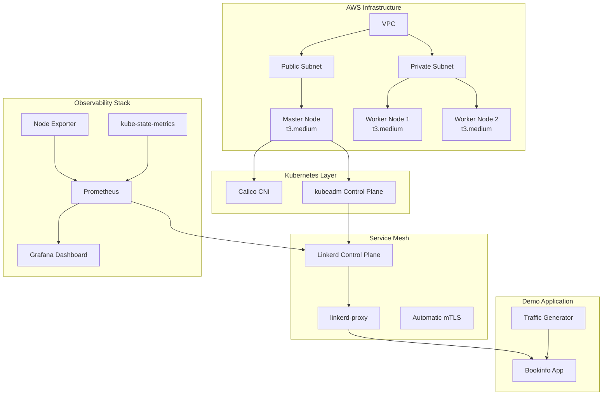

# 🚀 Kubernetes 관찰성 플랫폼

[](LICENSE)
[](https://aws.amazon.com/)
[](https://www.terraform.io/)
[](https://kubernetes.io/)
[](https://linkerd.io/)
[](https://prometheus.io/)
[](https://grafana.com/)

AWS EC2 기반 자체 관리형 Kubernetes 클러스터에서 **Linkerd 서비스 메시**와 **Prometheus/Grafana 관찰성 스택**을 통합 구성하는 프로덕션급 데모 플랫폼입니다.

---

## 주요 특징

🎯 **완전한 관찰성**: Linkerd 서비스 메시 + Prometheus + Grafana 통합 모니터링  
🏗️ **Infrastructure as Code**: Terraform + Kubernetes Manifest 기반 자동화  
💰 **비용 최적화**: 일일 재구축 워크플로우로 AWS 비용 절약  
🔒 **자동 mTLS**: Linkerd 기반 마이크로서비스 간 암호화 통신  
📊 **실시간 메트릭**: 서비스 성능, 트래픽, 장애율 실시간 추적  
🚀 **30분 배포**: 완전 자동화된 원클릭 배포 시스템

---

## 🏛️ 아키텍처



---

## 🚀 빠른 시작

### 1️⃣ 인프라 프로비저닝

```bash
# 레포지토리 클론
git clone https://github.com/dongkoony/k8s-ec2-observability.git
cd k8s-ec2-observability

# Terraform으로 AWS 인프라 생성
terraform init
terraform plan
terraform apply -auto-approve
```

### 2️⃣ 마스터 노드 접속

```bash
# 마스터 노드 IP 확인
export MASTER_IP=$(terraform output -json | jq -r '.master_public_ip.value')
echo "Master Node IP: $MASTER_IP"

# SSH 접속
ssh -i ~/.ssh/k8s-key.pem ubuntu@$MASTER_IP
```

### 3️⃣ 관찰성 스택 배포

```bash
# feature/linkerd 브랜치 체크아웃
git clone https://github.com/dongkoony/k8s-ec2-observability.git
cd k8s-ec2-observability
git checkout feature/linkerd

# 원클릭 배포 실행
bash scripts/deploy-observability-stack.sh
```

### 4️⃣ 접속 정보

배포 완료 후 다음 URL로 접속 가능합니다:

- **📊 Grafana**: `http://<MASTER_IP>:30300` (admin/prom-operator)
- **🛍️ Bookinfo**: `http://<MASTER_IP>:30080`
- **🔍 Linkerd Viz**: `linkerd viz dashboard` (port-forward)

---

## 📁 프로젝트 구조

```
k8s-ec2-observability/
├── 📄 README.md                          # 프로젝트 개요 및 시작 가이드
├── 📄 LICENSE                            # MIT 라이선스
├── 🔧 infra/                             # 인프라 정의
│   └── terraform/                       # Terraform 코드
│       ├── main.tf                      # 메인 인프라 정의
│       ├── variables.tf                 # 입력 변수 정의
│       ├── outputs.tf                   # 출력값 (IP 주소 등)
│       ├── provider.tf                  # AWS 프로바이더 설정
│       ├── locals.tf                    # 로컬 변수
│       ├── terraform.tfvars             # 변수 값 설정
│       ├── .terraform.lock.hcl          # 의존성 잠금 파일
│       ├── README-kr.md                 # 한국어 가이드
│       ├── README-us.md                 # 영어 가이드
│       ├── modules/                     # 재사용 가능한 Terraform 모듈
│       │   ├── vpc/                     # VPC 모듈 (네트워킹)
│       │   ├── ec2-master/              # 마스터 노드 모듈
│       │   ├── ec2-worker/              # 워커 노드 모듈
│       │   ├── security/                # 보안 그룹 모듈
│       │   ├── iam/                     # IAM 역할 모듈
│       │   ├── kms/                     # KMS 암호화 모듈
│       │   └── s3/                      # S3 스토리지 모듈
│       ├── examples/                    # 예제 설정
│       │   └── kms/                     # KMS 예제 설정
│       └── test/                        # 자동화 테스트
│           ├── unit/                    # 단위 테스트
│           │   ├── ec2/                 # EC2 단위 테스트
│           │   └── kms/                 # KMS 단위 테스트
│           ├── integration/             # 통합 테스트
│           │   └── kms_ec2/             # KMS+EC2 통합 테스트
│           └── helpers/                 # 테스트 헬퍼 함수
├── 📊 manifests/                         # Kubernetes 매니페스트
│   ├── linkerd/                         # Linkerd 서비스 메시
│   │   ├── install-crds.yml            # Custom Resource 정의
│   │   ├── install-control-plane.yml   # Linkerd Control Plane
│   │   └── install-viz.yml             # 시각화 확장 (Prometheus/Grafana)
│   ├── observability/                   # 관찰성 스택
│   │   └── prometheus-stack-values.yml # Prometheus + Grafana Helm Values
│   └── applications/                    # 데모 애플리케이션
│       ├── bookinfo-with-linkerd.yml   # Istio Bookinfo 샘플 앱
│       └── traffic-generator.yml       # 자동 트래픽 생성기
├── 🚀 scripts/                          # 배포 자동화 스크립트
│   ├── deploy-observability-stack.sh   # 전체 스택 원클릭 배포
│   ├── combined_settings.sh            # 통합 클러스터 설정
│   ├── system_settings.sh              # 시스템 초기 설정
│   ├── worker_setup.sh                 # 워커 노드 전용 설정
│   ├── README.md                       # 스크립트 사용법 (한국어)
│   └── README-en.md                    # 스크립트 사용법 (영어)
├── 📚 docs/                             # 프로젝트 문서
│   ├── architecture/                    # 아키텍처 설계 문서
│   ├── terraform/                       # Terraform 모듈 문서
│   │   └── modules/                     # 각 모듈별 상세 가이드
│   │       └── kms/                     # KMS 모듈 문서
│   └── images/                          # 스크린샷 및 다이어그램
│       ├── Kubernetes-API server.png   # K8s API 서버 대시보드
│       ├── Prometheus- Overview.png    # Prometheus 개요 화면
│       └── CoreDNS.png                 # CoreDNS 모니터링 화면
├── 🔄 .github/                          # GitHub Actions CI/CD
│   └── workflows/                       # 자동화 워크플로우
│       ├── terraform-test.yml          # Terraform 자동 테스트
│       ├── manual-test.yml             # 수동 트리거 테스트
│       └── README.md                   # CI/CD 가이드
└── 📋 .gitignore                        # Git 제외 파일 설정
```

---

## ⚙️ 시스템 요구사항

### AWS 리소스
- **VPC**: 1개 (Public/Private Subnet)
- **EC2**: 3대 (Master 1대 + Worker 2대)
- **인스턴스 타입**: t3.medium (2 vCPU, 4GB RAM)
- **스토리지**: gp3 20GB (각 인스턴스)
- **보안 그룹**: SSH, HTTP, Kubernetes API 포트 개방

### 로컬 환경
- **AWS CLI**: 설정된 자격 증명
- **Terraform**: ≥ v1.0
- **SSH Key**: AWS EC2 키 페어
- **Git**: 레포지토리 클론용

---

## 🎯 핵심 기능

### 🔄 **일일 재구축 워크플로우**
```bash
# 매일 저녁 - 비용 절약을 위한 리소스 해제
terraform destroy -auto-approve

# 다음날 아침 - 30분 내 전체 스택 복원
terraform apply -auto-approve
ssh -i ~/.ssh/k8s-key.pem ubuntu@$(terraform output -json | jq -r '.master_public_ip.value')
bash scripts/deploy-observability-stack.sh
```

### 🔐 **자동 mTLS 암호화**
- Linkerd 기반 모든 마이크로서비스 간 자동 암호화
- 인증서 자동 발급 및 순환
- 제로 트러스트 네트워크 보안

### 📊 **통합 모니터링**
- **Prometheus**: 메트릭 수집 및 저장
- **Grafana**: 실시간 대시보드 및 알림
- **Node Exporter**: 시스템 레벨 메트릭
- **kube-state-metrics**: Kubernetes 리소스 상태

### 🛠️ **Infrastructure as Code**
- **Terraform**: AWS 리소스 관리
- **Kubernetes Manifest**: 애플리케이션 배포
- **Helm Charts**: 복잡한 애플리케이션 패키징
- **Git 기반 배포**: 버전 관리 및 롤백 지원

---

## 🧪 데모 시나리오

### 📈 **실시간 트래픽 모니터링**
1. Bookinfo 애플리케이션에 지속적인 트래픽 생성
2. Grafana에서 서비스별 요청 수, 응답 시간, 성공률 모니터링
3. Linkerd를 통한 서비스 간 호출 관계 시각화

### 🚨 **장애 시뮬레이션**
1. 특정 서비스 Pod 삭제로 장애 발생
2. Prometheus Alert 자동 발생
3. Grafana 대시보드에서 장애 감지 및 복구 과정 추적

### 🔄 **카나리 배포**
1. reviews 서비스의 v1, v2, v3 버전 동시 운영
2. 트래픽 분할을 통한 점진적 배포
3. 메트릭 기반 배포 성공 여부 판단

---

## 🤝 Contributing

1. **Fork & Clone** 
   ```bash
   git fork https://github.com/dongkoony/k8s-ec2-observability.git
   git clone <your-fork-url>
   ```

2. **Feature Branch 생성**
   ```bash
   git checkout -b feature/your-feature-name
   ```

3. **변경사항 커밋 & 푸시**
   ```bash
   git add .
   git commit -m "Add: your feature description"
   git push origin feature/your-feature-name
   ```

4. **Pull Request 생성**

---

## 📄 라이선스

이 프로젝트는 [MIT License](LICENSE) 하에 배포됩니다.

---

## 🙋‍♂️ 지원

- **Issues**: [GitHub Issues](https://github.com/dongkoony/k8s-ec2-observability/issues)
- **Documentation**: [docs/architecture](docs/architecture/)
- **Contact**: 프로젝트 관련 문의사항 dhyeon.shin@icloud.com

---

<div align="center">

**⭐ 이 프로젝트가 도움이 되었다면 Star를 눌러주세요! ⭐**

Made with ❤️ for the Kubernetes Community

</div>
