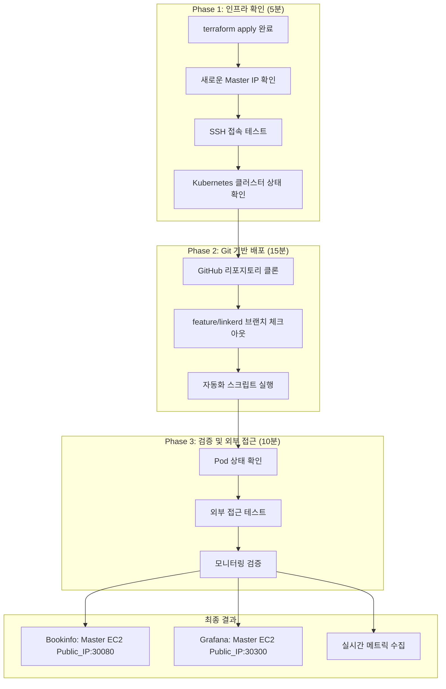
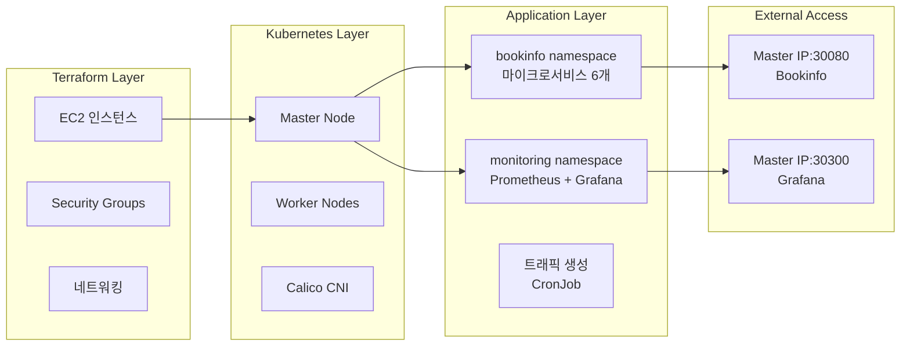

# Step 0: 일일 인프라 재구축 → 완전한 관찰가능성 스택 구축 가이드

**작성 날짜**: 2025년 7월 1일  
**적용 대상**: terraform destroy/apply 후 새로운 환경  

---

## 🎯 **가이드 목적**

**상황**
- **AWS 비용을 줄이려고** 매일 리소스를 지우고 다시 만들어야 함
- **Step 6에서 만든 Infrastructure as Code**로 **30분 안에 전체 스택을 복원**하는 게 목표

**필요한 것들**
- ✅ **Terraform이 완료된 상태**에서 시작 (EC2, VPC, Security Groups가 준비됨)
- ✅ **깨끗한 Kubernetes 클러스터** (kubeadm, Calico CNI 설정 완료)
- ✅ **feature/linkerd 브랜치**의 Infrastructure as Code manifest 사용
- ✅ **외부에서 접근할 수 있는 관찰가능성 플랫폼** 완성

**성공했다고 볼 수 있는 기준**
- 🚀 **30분 안에 전체 스택이 동작함**: Prometheus + Grafana + Bookinfo + 트래픽 생성
- 🌐 **외부 접근이 됨**: http://Master EC2 Public_IP:30080 (Bookinfo), http://Master EC2 Public_IP:30300 (Grafana)
- 📊 **실시간 모니터링이 됨**: 메트릭 수집과 대시보드가 정상 작동

---

## 🏗️ **아키텍처 개요**

### **일일 재구축 워크플로우**


### **Infrastructure as Code 스택 구조**


### **핵심 설계 결정**
1. **Git을 기반으로 배포**: feature/linkerd 브랜치의 manifest 파일 활용
2. **마스터 노드에 집중**: Self-managed 환경에 최적화된 패턴 적용
3. **HostPort 전략**: NodePort 제약을 근본적으로 우회
4. **자동화 스크립트**: 수동으로 할 일을 최소화

---

## 🚀 **Phase 1: 초기 환경 확인**

### **Step 1.1: 새로운 인프라 정보 확인**

```bash
# 로컬 터미널에서 실행
cd ~/Project/k8s-ec2-observability

# Terraform 출력값 확인
terraform output -json | jq -r '.master_public_ip.value'
# 예시 출력: 13.124.XXX.XXX (매번 새로운 IP)

# 출력값을 변수로 저장
export MASTER_IP=$(terraform output -json | jq -r '.master_public_ip.value')
echo "🚀 새로운 Master IP: $MASTER_IP"
```

### **Step 1.2: SSH 접속 및 기본 상태 확인**

```bash
# SSH 키 권한 확인
chmod 400 ~/.ssh/k8s-key.pem

# 마스터 노드 접속
ssh -i ~/.ssh/k8s-key.pem ubuntu@$MASTER_IP

# 접속 후 기본 확인사항
echo "=== Kubernetes 클러스터 상태 확인 ==="
kubectl get nodes
# 기대값: 3개 노드 모두 Ready 상태

kubectl get pods --all-namespaces
# 기대값: kube-system, calico-system namespace만 존재

kubectl cluster-info
# 기대값: Kubernetes control plane 정상 동작
```

**✅ 나와야 하는 결과:**
```bash
NAME               STATUS   ROLES           AGE   VERSION
ip-10-0-1-xxx      Ready    control-plane   5m    v1.28.x
ip-10-0-2-xxx      Ready    <none>          4m    v1.28.x  
ip-10-0-2-yyy      Ready    <none>          4m    v1.28.x
```

### **Step 1.3: 네트워킹 검증**

```bash
# Calico CNI 상태 확인
kubectl get pods -n calico-system
# 모든 Pod이 Running 상태여야 함

# 노드 간 통신 테스트
kubectl run test-pod --image=busybox --rm -it --restart=Never -- ping -c 3 8.8.8.8
# 성공적인 인터넷 접속 확인
```

---

## 🚀 **Phase 2: Infrastructure as Code 배포**

### **Step 2.1: Git 리포지토리 준비**

```bash
# 마스터 노드에서 실행 (SSH 접속 상태)
# Git 설정 확인
git --version
# 없으면 설치: sudo apt update && sudo apt install -y git

# 프로젝트 디렉토리로 이동
cd /home/ubuntu

# 기존 클론된 디렉토리가 있으면 제거 (깨끗한 시작)
rm -rf k8s-ec2-observability

# GitHub 리포지토리 클론
git clone https://github.com/dongkoony/k8s-ec2-observability.git
cd k8s-ec2-observability

# feature/linkerd 브랜치 체크아웃
git checkout feature/linkerd
git pull origin feature/linkerd

# manifest 파일 구조 확인
tree manifests/
```

**✅ 예상 출력:**
```
manifests/
├── linkerd/
│   ├── install-crds.yml
│   ├── install-control-plane.yml
│   └── install-viz.yml
├── observability/
│   └── prometheus-stack-values.yml
└── applications/
    ├── bookinfo-with-linkerd.yml
    └── traffic-generator.yml
```

### **Step 2.2: 자동화 스크립트 실행**

```bash
# 스크립트 실행 권한 부여
chmod +x scripts/deploy-observability-stack.sh

# 전체 스택 자동 배포 시작
echo "🚀 Infrastructure as Code 배포 시작..."
./scripts/deploy-observability-stack.sh
```

**스크립트 실행 과정:**
1. **Helm 설치** (없는 경우)
2. **Prometheus Stack 배포** (monitoring namespace)
3. **Linkerd 설치** (linkerd namespace)  
4. **Bookinfo 애플리케이션 배포** (bookinfo namespace)
5. **트래픽 생성기 시작** (지속적 트래픽)

### **Step 2.3: Self-managed 최적화 적용**

```bash
# PVC 문제 해결을 위한 추가 설정 (필요 시)
echo "📋 Self-managed 환경 최적화 적용..."

# Grafana 마스터노드 배치 (외부 접근을 위해)
kubectl patch deployment prometheus-grafana -n monitoring --type='json' -p='[
  {"op": "add", "path": "/spec/template/spec/nodeSelector", 
   "value": {"node-role.kubernetes.io/control-plane": ""}},
  {"op": "add", "path": "/spec/template/spec/tolerations",
   "value": [{"key": "node-role.kubernetes.io/control-plane", 
             "operator": "Exists", "effect": "NoSchedule"}]}
]'

# ProductPage 마스터노드 배치 및 HostPort 설정
kubectl patch deployment productpage-v1 -n bookinfo --type='json' -p='[
  {"op": "add", "path": "/spec/template/spec/containers/0/ports", 
   "value": [{"containerPort": 9080, "hostPort": 30080}]},
  {"op": "add", "path": "/spec/template/spec/nodeSelector", 
   "value": {"node-role.kubernetes.io/control-plane": ""}},
  {"op": "add", "path": "/spec/template/spec/tolerations",
   "value": [{"key": "node-role.kubernetes.io/control-plane", 
             "operator": "Exists", "effect": "NoSchedule"}]}
]'

echo "✅ Self-managed 최적화 완료"
```

---

## 🚀 **Phase 3: 배포 검증 및 외부 접근**

### **Step 3.1: 전체 시스템 상태 확인**

```bash
echo "=== 배포 완료 상태 확인 ==="

# 모든 네임스페이스 Pod 상태
kubectl get pods --all-namespaces

# 예상 결과 요약
echo "📊 예상 Pod 수:"
echo "- monitoring: 8개 (Prometheus Stack)"
echo "- bookinfo: 6개 (마이크로서비스)"  
echo "- linkerd: 3개 (Control Plane, 부분적 동작 가능)"
echo "- default: 1개 (트래픽 생성)"
```

**✅ 성공 기준:**
```bash
NAMESPACE     READY   STATUS
monitoring    8/8     Running
bookinfo      6/6     Running
linkerd       1-3/3   Running (부분적 동작 허용)
```

### **Step 3.2: 서비스 외부 접근 테스트**

```bash
# 현재 마스터 노드 IP 확인
CURRENT_IP=$(curl -s ifconfig.me)
echo "🌐 현재 마스터 노드 Public IP: $CURRENT_IP"

# Bookinfo 애플리케이션 접근 테스트
echo "📱 Bookinfo 접근 테스트..."
curl -I http://$CURRENT_IP:30080/productpage
# 기대값: HTTP/1.1 200 OK

# Grafana 접근 테스트  
echo "📊 Grafana 접근 테스트..."
curl -I http://$CURRENT_IP:30300
# 기대값: HTTP/1.1 302 Found (로그인 페이지)
```

### **Step 3.3: 모니터링 데이터 검증**

```bash
# Prometheus 메트릭 수집 확인
kubectl exec -n monitoring deployment/prometheus-prometheus-kube-prometheus-prometheus -- \
  promtool query instant 'up'

# 트래픽 생성 상태 확인
kubectl get jobs -n bookinfo
kubectl get cronjobs -n bookinfo

# Grafana 로그인 정보 확인
echo "📊 Grafana 접근 정보:"
echo "URL: http://$CURRENT_IP:30300"
echo "Username: admin"
kubectl get secret --namespace monitoring prometheus-grafana -o jsonpath="{.data.admin-password}" | base64 --decode
echo ""
```

---

## 🎯 **성공 완료 체크리스트**

### **✅ 인프라 계층**
- [ ] **terraform apply 완료**: EC2, VPC, Security Groups 정상
- [ ] **Kubernetes 클러스터**: 3개 노드 모두 Ready 상태  
- [ ] **Calico CNI**: Pod 간 네트워킹 정상 동작
- [ ] **SSH 접속**: 마스터 노드 접근 가능

### **✅ 애플리케이션 계층**  
- [ ] **Prometheus Stack**: monitoring namespace 8개 Pod Running
- [ ] **Bookinfo 앱**: bookinfo namespace 6개 Pod Running
- [ ] **트래픽 생성**: Job/CronJob 정상 실행
- [ ] **Linkerd**: linkerd namespace 부분적 동작 (허용)

### **✅ 외부 접근**
- [ ] **Bookinfo**: http://Master_IP:30080/productpage (HTTP 200)
- [ ] **Grafana**: http://Master_IP:30300 (HTTP 302 → 로그인)
- [ ] **메트릭 수집**: Prometheus에서 실시간 데이터 확인
- [ ] **대시보드**: Grafana에서 시각화 정상

### **✅ 운영 준비**
- [ ] **로그인 정보**: Grafana admin 패스워드 확인
- [ ] **IP 주소 기록**: 새로운 Master IP 문서화
- [ ] **모니터링 검증**: 5분간 메트릭 수집 확인

---

## 🔧 **트러블슈팅 가이드**

### **문제 1: PVC Pending 상태**
```bash
# 증상 확인
kubectl get pvc -n monitoring
# STATUS: Pending

# 해결방법: values.yml에서 PVC 비활성화 확인
grep -A 5 "persistence:" manifests/observability/prometheus-stack-values.yml
# enabled: false 확인

# 재배포
helm upgrade prometheus prometheus-community/kube-prometheus-stack \
    --namespace monitoring \
    --values manifests/observability/prometheus-stack-values.yml
```

### **문제 2: 외부 접근 실패**
```bash
# 증상: curl 타임아웃 또는 연결 거부

# 1. 보안그룹 확인
aws ec2 describe-security-groups --group-ids sg-xxx

# 2. Pod가 마스터노드에 배치되었는지 확인
kubectl get pods -o wide -n bookinfo | grep productpage
kubectl get pods -o wide -n monitoring | grep grafana

# 3. HostPort 설정 확인
kubectl describe pod productpage-xxx -n bookinfo | grep -A 5 "Ports:"
```

### **문제 3: Linkerd CrashLoopBackOff**
```bash
# 증상 확인
kubectl get pods -n linkerd
# STATUS: CrashLoopBackOff

# 허용된 상황: 부분적 동작으로도 핵심 기능 사용 가능
# 해결 시도 (선택적)
kubectl patch deployment linkerd-destination -n linkerd --type='json' -p='[
  {"op": "add", "path": "/spec/template/spec/nodeSelector", 
   "value": {"node-role.kubernetes.io/control-plane": ""}}
]'
```

---

## 📈 **성능 최적화 팁**

### **배포 시간 단축**
1. **Helm 차트 캐싱**: 
   ```bash
   helm repo update  # 주기적으로 실행
   ```

2. **이미지 사전 다운로드**: 
   ```bash
   # 워커 노드에서 사전 pull (선택적)
   docker pull prom/prometheus:latest
   docker pull grafana/grafana:latest
   ```

3. **병렬 배포**: 
   ```bash
   # Prometheus와 Bookinfo 동시 배포 가능
   kubectl apply -f manifests/applications/bookinfo-with-linkerd.yml &
   helm install prometheus ... &
   wait  # 모든 백그라운드 작업 완료 대기
   ```

### **리소스 최적화**
```bash
# 메모리 사용량 모니터링
kubectl top nodes
kubectl top pods --all-namespaces

# 필요 시 리소스 제한 조정
kubectl patch deployment productpage-v1 -n bookinfo --type='json' -p='[
  {"op": "add", "path": "/spec/template/spec/containers/0/resources", 
   "value": {"limits": {"memory": "256Mi", "cpu": "200m"}}}
]'
```

---

## 🎯 **다음 단계 연결점**

### **Step 7 준비사항**
이 가이드 완료 후 **다음 단계 선택 가능:**

1. **분산 트레이싱 (Jaeger)**: 
   - 현재 스택에 Jaeger 추가
   - Bookinfo 트레이싱 활성화

2. **Linkerd 완전 해결**: 
   - CrashLoopBackOff 근본 해결
   - mTLS 자동 암호화 구현

3. **보안 강화**: 
   - RBAC 정책 구현
   - NetworkPolicy 적용

### **데일리 체크포인트**
```bash
# 매일 기록할 정보
echo "📋 $(date): 새로운 인프라 구축 완료"
echo "Master IP: $(curl -s ifconfig.me)"
echo "Bookinfo: http://$(curl -s ifconfig.me):30080/productpage"  
echo "Grafana: http://$(curl -s ifconfig.me):30300"
```

---

## 💡 **핵심 학습 포인트**

### **Infrastructure as Code의 진가**
1. **재현성**: 매번 동일한 환경 구성 가능
2. **효율성**: 30분 내 전체 스택 복원
3. **문서화**: Git 기반 변경사항 추적

### **Self-managed 환경 마스터리**
1. **제약 활용**: 마스터노드 집중 배치 전략
2. **네트워킹 최적화**: HostPort + nodeSelector 패턴
3. **문제 예방**: PVC 비활성화 등 사전 최적화

### **운영 효율성**
1. **자동화**: 수동 개입 최소화
2. **검증**: 단계별 확인으로 문제 조기 발견  
3. **확장성**: 새로운 컴포넌트 추가 준비

---

## 🎉 **Step 0 가이드 완성**

### **✅ 달성 가치**
- 🚀 **30분 완전 복원**: terraform apply → 운영 가능 플랫폼
- 📋 **완전한 재현성**: Infrastructure as Code 기반 표준화
- 🌐 **즉시 사용 가능**: 외부 접근 + 실시간 모니터링
- 📖 **운영 가이드**: 신규 팀원도 즉시 활용 가능

### **비즈니스 임팩트**
- **운영 비용 절약**: 매일 destroy/apply로 AWS 요금 최적화
- **개발 생산성**: 빠른 환경 복원으로 개발 시간 단축
- **위험 관리**: 표준화된 절차로 실수 방지
- **지식 공유**: 문서화된 가이드로 팀 역량 향상

**Step 0 가이드는 Infrastructure as Code의 진정한 가치를 실현하는 실무 중심 문서입니다!**