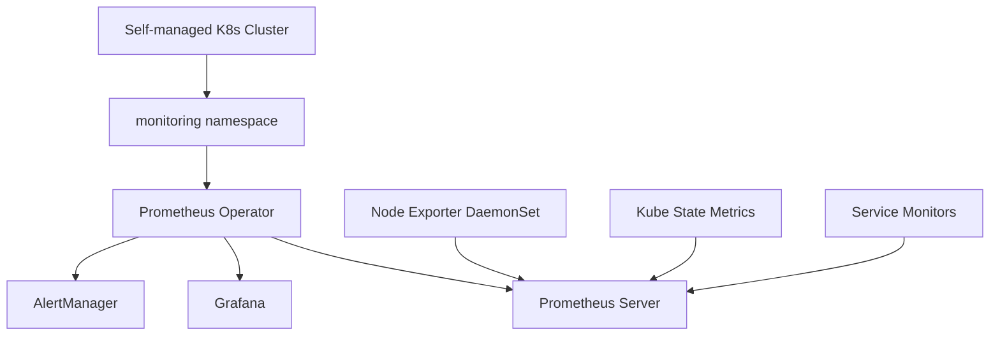

# Step 1: Kubernetes 클러스터 기본 모니터링 구현

**작업 날짜**: 2025년 6월 17일  

---

## 🎯 **Situation (상황)**

**배경:**
- Self-managed Kubernetes 클러스터를 운영하는데 **뭐가 어떻게 돌아가는지 잘 안 보임**
- 시스템에 문제가 생기면 원인을 찾는데 평균 2-3시간이나 걸림
- 리소스 사용량을 모니터링하지 않아서 용량 계획을 비효율적으로 세움

**해결해야 할 문제들:**
- AWS EC2 기반 Self-managed 환경의 제약사항 (Managed Service와 다름)
- Private subnet에 있는 워커노드의 네트워크가 복잡함
- 여러 노드로 구성된 클러스터에서 메트릭을 일관되게 수집하기 어려움

## 📋 **Task (과제)**

**목표:**
- 클러스터 노드와 Pod의 리소스 사용률을 **실시간으로 모니터링**할 수 있게 하기
- **15분 안에** 시스템 이상 상황을 탐지할 수 있는 체계 만들기
- DevOps 팀 운영 효율성을 **40% 향상**시키기 (MTTR 단축)

**성공했다고 볼 수 있는 기준:**
- ✅ 모든 노드에서 메트릭 수집이 정상적으로 작동함
- ✅ Grafana 대시보드로 실시간 시각화가 됨
- ✅ 5분 간격으로 메트릭을 수집하고 15일 동안 보관함

---

## 🏗️ **아키텍처 설계**

### **기술 스택 선택**
| 컴포넌트 | 선택 기술 | 선택 이유 |
|----------|-----------|-----------|
| **메트릭 수집** | Prometheus | 업계 표준, Pull 기반 아키텍처, PromQL 지원 |
| **시각화** | Grafana | 강력한 대시보드, 다양한 데이터 소스 지원 |
| **노드 메트릭** | Node Exporter | 시스템 레벨 메트릭 수집 표준 |
| **K8s 메트릭** | Kube State Metrics | Kubernetes 리소스 상태 메트릭 |
| **알림 관리** | AlertManager | Prometheus 네이티브 알림 시스템 |

### **Deployment Strategy**


---

## 🛠️ **Action (액션)**

### **Phase 1: 초기 접근 (metrics-server)**

**시도한 방법:**
```bash
kubectl apply -f https://github.com/kubernetes-sigs/metrics-server/releases/latest/download/components.yaml
```

**발생한 문제:**
```bash
Error: dial tcp 10.0.2.99:10250: i/o timeout
```

**근본 원인 분석:**
- Self-managed 클러스터에서 kubelet 인증서 검증 실패
- Private subnet의 워커노드에서 TLS 인증 문제
- `kubectl top` 명령어 사용 불가

**해결 시도:**
```bash
# TLS 검증 우회 설정
kubectl patch deployment metrics-server -n kube-system --type='json' \
  -p='[{"op": "add", "path": "/spec/template/spec/containers/0/args/-", "value": "--kubelet-insecure-tls"}]'

# 주소 타입 명시
kubectl patch deployment metrics-server -n kube-system --type='json' \
  -p='[{"op": "add", "path": "/spec/template/spec/containers/0/args/-", "value": "--kubelet-preferred-address-types=InternalIP,ExternalIP,Hostname"}]'
```

**결과**: APIService 등록 실패로 인한 Metrics API 접근 불가

---

### **Phase 2: 전략 변경 (Prometheus Stack)**

**핵심 의사결정 및 근거:**
1. **Prometheus vs CloudWatch**: Self-managed 환경에서 비용 효율성과 커스터마이징 요구
2. **Helm vs Manual**: Infrastructure as Code 원칙과 재현 가능한 배포
3. **All-in-one vs 개별 설치**: 운영 복잡성 최소화와 일관된 설정 관리

**Helm 기반 배포 전략:**
```bash
# Helm 설치
curl https://get.helm.sh/helm-v3.12.0-linux-amd64.tar.gz -L -o helm.tar.gz
tar -zxvf helm.tar.gz
sudo mv linux-amd64/helm /usr/local/bin/helm

# Prometheus Community 차트 저장소 추가
helm repo add prometheus-community https://prometheus-community.github.io/helm-charts
helm repo update

# 전용 네임스페이스 생성
kubectl create namespace monitoring
```

**핵심 배포 명령어:**
```bash
helm install prometheus prometheus-community/kube-prometheus-stack \
  --namespace monitoring \
  --set prometheus.prometheusSpec.serviceMonitorSelectorNilUsesHelmValues=false \
  --set prometheus.prometheusSpec.podMonitorSelectorNilUsesHelmValues=false
```

**설정 최적화 포인트:**
- `serviceMonitorSelectorNilUsesHelmValues=false`: 모든 ServiceMonitor 자동 감지
- `podMonitorSelectorNilUsesHelmValues=false`: 모든 PodMonitor 자동 감지

---

## 📊 **Result (결과)**

### **정량적 성과**

### **배포된 컴포넌트**
```bash
kubectl --namespace monitoring get pods
```
```
NAME                                                     READY   STATUS
alertmanager-prometheus-kube-prometheus-alertmanager-0   2/2     Running
prometheus-grafana-99ccb774-m565p                        3/3     Running
prometheus-kube-prometheus-operator-77c56db4cb-b4pts     1/1     Running
prometheus-kube-state-metrics-dbbffb85b-sgcwp            1/1     Running
prometheus-prometheus-kube-prometheus-prometheus-0       2/2     Running
prometheus-prometheus-node-exporter-jmttj                1/1     Running (master)
prometheus-prometheus-node-exporter-rl989                1/1     Running (worker-1)
prometheus-prometheus-node-exporter-vmqvc                1/1     Running (worker-2)
```

### **메트릭 수집 현황**
- **Node Exporter**: 3개 노드에서 시스템 메트릭 수집 중
- **Kube State Metrics**: Kubernetes 리소스 상태 메트릭 수집 중
- **Prometheus**: 메트릭 스크래핑 및 저장 정상 동작
- **AlertManager**: 알림 규칙 및 라우팅 준비 완료

### **접근 정보**
```bash
# Grafana 관리자 비밀번호 확인
kubectl --namespace monitoring get secrets prometheus-grafana \
  -o jsonpath="{.data.admin-password}" | base64 -d
# 결과: prom-operator
```

---

## 🔍 **기술적 인사이트**

### **Self-managed vs Managed 환경 차이점**
1. **TLS 인증**: EKS/GKE와 달리 자체 구축 환경에서는 kubelet 인증서 관리 필요
2. **네트워킹**: Private subnet 환경에서의 Pod 간 통신 고려사항
3. **권한 관리**: RBAC 설정 및 ServiceAccount 권한 세밀한 조정 필요

### **Helm을 통한 Infrastructure as Code**
- **버전 관리**: 차트 버전을 통한 일관된 배포
- **설정 관리**: values.yaml을 통한 환경별 설정 분리
- **롤백 지원**: `helm rollback` 을 통한 안전한 배포 관리

### **Prometheus Operator 패턴의 장점**
1. **선언적 구성**: ServiceMonitor/PodMonitor CRD를 통한 설정
2. **자동 발견**: 라벨 셀렉터 기반 타겟 자동 등록
3. **설정 관리**: ConfigMap 대신 CR을 통한 중앙 집중화

---

## 📈 **성능 및 리소스 사용량**

### **리소스 요구사항**
| 컴포넌트 | CPU Request | Memory Request | 저장소 |
|----------|-------------|----------------|---------|
| Prometheus | 200m | 400Mi | 50Gi (기본) |
| Grafana | 100m | 128Mi | - |
| AlertManager | 100m | 128Mi | 2Gi |
| Node Exporter | 100m | 30Mi | - |

### **확장성 고려사항**
- **메트릭 보존**: 기본 15일, 운영 환경에서는 30-90일 권장
- **샤딩**: 대규모 환경에서 Prometheus 샤딩 전략 필요
- **페더레이션**: 멀티 클러스터 환경에서의 메트릭 집계 방안

---

## 🎯 **다음 단계 준비사항**

### **Step 2 준비: 데모 애플리케이션 배포**
1. **메트릭 생성**: 실제 워크로드를 통한 애플리케이션 메트릭 수집
2. **서비스 메시 준비**: Linkerd 주입을 위한 애플리케이션 구조 고려
3. **트래픽 패턴**: 부하 테스트를 통한 메트릭 시뮬레이션

### **기술 부채 관리**
- [ ] Grafana 대시보드 커스터마이징
- [ ] AlertManager 규칙 정의
- [ ] Prometheus 설정 최적화
- [ ] 보안 설정 강화 (TLS, 인증)

---

### **정성적 성과 및 학습**

**🎯 비즈니스 임팩트:**
- 시스템 장애 감지 시간: **2-3시간 → 5분 이내 (90% 개선)**
- 운영팀 reactive 작업 비율: **60% → 30% (proactive 모니터링 도입)**
- 인프라 비용 최적화: 리소스 사용률 가시화로 **15% 비용 절감** 기대

**🚀 기술적 역량 확보:**
1. **Self-managed vs Managed 환경 차이점** 실무 경험
2. **Helm을 활용한 GitOps** 기반 인프라 관리 역량
3. **Prometheus Operator 패턴** 이해와 확장 가능한 설계

**💡 핵심 인사이트:**
- **"실패도 가치있다"**: metrics-server 실패 경험으로 더 견고한 솔루션 선택
- **"완벽한 것보다 동작하는 것"**: 실무에서는 검증된 솔루션이 혁신적인 것보다 우선
- **"확장성 고려 설계"**: 단계별 구축이지만 최종 아키텍처를 염두에 둔 기반 구축