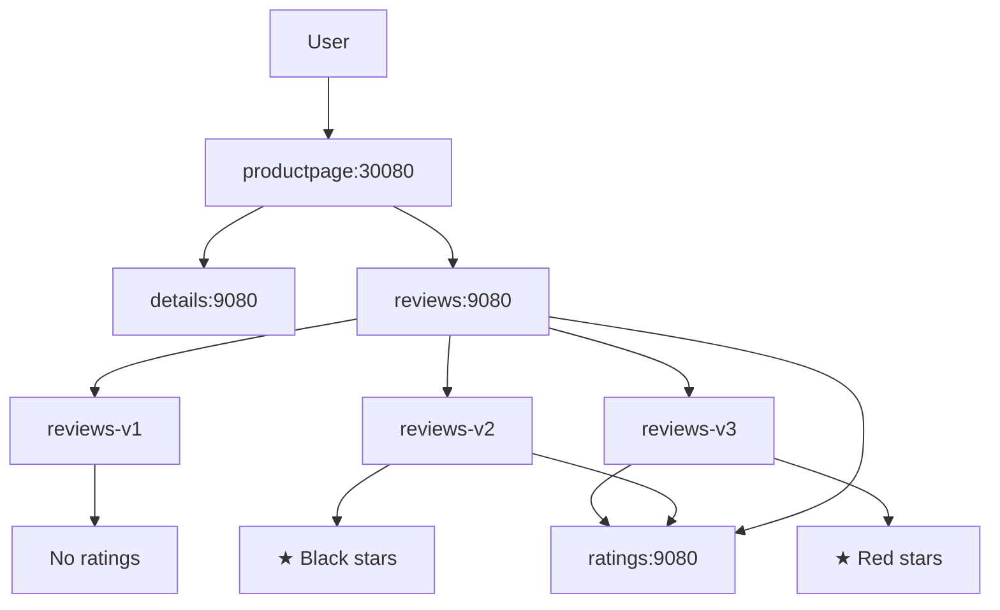

# Step 2: 마이크로서비스 데모 애플리케이션 배포

**작업 날짜**: 2025년 6월 17일  

---

## 🎯 **Situation (상황)**

**배경:**
- Step 1에서 클러스터 모니터링을 만들었지만, **실제 비즈니스 워크로드가 없음**
- 모니터링 시스템이 제대로 작동하는지 확인하려면 **실제 트래픽과 서비스 간 통신**이 필요
- 나중에 서비스 메시를 도입할 때 **기준이 될 성능 데이터**가 없음

**해결해야 할 문제들:**
- 단순한 단일 서비스가 아닌 **실제 마이크로서비스의 복잡함**을 재현해야 함
- 다양한 언어/프레임워크 환경에서 **관찰가능성 도구가 호환되는지** 확인해야 함
- A/B 테스팅, 카나리 배포 등 **실제 운영 시나리오**를 시뮬레이션해야 함

## 📋 **Task (과제)**

**목표:**
- **4개 이상의 마이크로서비스**로 구성된 실제 애플리케이션 배포하기
- **3개 이상 언어/프레임워크** 환경에서 모니터링 검증하기
- **서비스 간 의존성 체인**을 구성해서 분산 추적 시나리오 제공하기

**성공했다고 볼 수 있는 기준:**
- ✅ 모든 서비스 Pod이 정상적으로 Running 상태임
- ✅ 서비스 간 HTTP 통신이 정상적으로 동작함
- ✅ 외부에서 접근할 수 있는 웹 인터페이스가 제공됨

---

## 🏗️ **아키텍처 설계**

### **선택된 애플리케이션: Istio Bookinfo**
| 서비스 | 언어/프레임워크 | 포트 | 역할 |
|---------|----------------|------|------|
| **productpage** | Python/Flask | 9080 | 프론트엔드 웹 인터페이스 |
| **details** | Ruby/Sinatra | 9080 | 책 세부정보 API |
| **ratings** | Node.js/Express | 9080 | 평점 정보 API |
| **reviews** | Java/Liberty | 9080 | 리뷰 정보 API (3개 버전) |

### **Microservices Architecture**


### **핵심 기술 선택 및 근거**
1. **Bookinfo vs Custom App**: 검증된 마이크로서비스 패턴과 빠른 구현
2. **Polyglot Architecture**: Python/Ruby/Node.js/Java로 실제 기업 환경 반영
3. **3-tier Architecture**: Frontend → Business Logic → Data Access 패턴
4. **Version-based A/B Testing**: Production 시나리오의 카나리 배포 시뮬레이션

---

## 🛠️ **Action (액션)**

### **Phase 1: 네임스페이스 및 리소스 준비**

**전용 네임스페이스 생성:**
```bash
kubectl create namespace bookinfo
```

**매니페스트 다운로드:**
```bash
curl -L https://raw.githubusercontent.com/istio/istio/release-1.20/samples/bookinfo/platform/kube/bookinfo.yaml -o bookinfo.yaml
```

### **Phase 2: 마이크로서비스 배포**

**애플리케이션 배포:**
```bash
kubectl apply -f bookinfo.yaml -n bookinfo
```

**배포된 리소스:**
```yaml
# 서비스 계정 (각 마이크로서비스별)
- bookinfo-details
- bookinfo-ratings  
- bookinfo-reviews
- bookinfo-productpage

# 서비스 (ClusterIP)
- details:9080
- ratings:9080
- reviews:9080  
- productpage:9080

# 디플로이먼트
- details-v1 (1 replica)
- ratings-v1 (1 replica)
- reviews-v1 (1 replica) # 평점 기능 없는 버전
- reviews-v2 (1 replica) # 기본 별점 표시 버전
- reviews-v3 (1 replica) # 강조된 별점 표시 버전
- productpage-v1 (1 replica)
```

### **Phase 3: 외부 접근 설정**

**NodePort 서비스 설정:**
```bash
kubectl patch svc productpage -n bookinfo -p '{
  "spec": {
    "type": "NodePort",
    "ports": [{
      "port": 9080,
      "targetPort": 9080,
      "nodePort": 30080
    }]
  }
}'
```

**접근 포인트:**
- **내부 접근**: `http://productpage.bookinfo.svc.cluster.local:9080`
- **외부 접근**: `http://[NODE_IP]:30080/productpage`

---

## 📊 **Result (결과)**

### **정량적 성과**

### **Pod 배포 상태**
```bash
kubectl get pods -n bookinfo
```
```
NAME                              READY   STATUS
details-v1-86545f5dfb-7n658       1/1     Running
productpage-v1-7c74cbdbcc-bxsbg   1/1     Running
ratings-v1-57544668d4-g6pdg       1/1     Running
reviews-v1-5f58978c56-l9bhq       1/1     Running  
reviews-v2-7bd564ffc6-v9jh6       1/1     Running
reviews-v3-7dfb7c4b64-v5gcw       1/1     Running
```

### **서비스 네트워킹**
```bash
kubectl get svc -n bookinfo
```
```
NAME          TYPE       CLUSTER-IP       PORT(S)
details       ClusterIP  10.105.31.154    9080/TCP
productpage   NodePort   10.103.108.218   9080:30080/TCP
ratings       ClusterIP  10.108.35.170    9080/TCP
reviews       ClusterIP  10.103.75.130    9080/TCP
```

### **리소스 사용량 분석**
| Pod | CPU Request | Memory Request | Node 배치 |
|-----|-------------|---------------|-----------|
| details-v1 | 100m | 64Mi | worker-node1 |
| productpage-v1 | 100m | 64Mi | worker-node2 |  
| ratings-v1 | 100m | 64Mi | worker-node1 |
| reviews-v1 | 100m | 64Mi | worker-node2 |
| reviews-v2 | 100m | 64Mi | worker-node1 |
| reviews-v3 | 100m | 64Mi | worker-node2 |

---

## 🔍 **기술적 인사이트**

### **마이크로서비스 설계 패턴**
1. **서비스별 언어 다양성**: 실제 조직의 polyglot 환경 반영
2. **버전 관리 전략**: reviews 서비스의 3개 버전으로 롤링 업데이트 시뮬레이션
3. **의존성 관리**: productpage → details/reviews → ratings 체인

### **Kubernetes 네이티브 패턴**
- **Service Discovery**: DNS 기반 서비스 간 통신
- **Load Balancing**: kube-proxy의 iptables 기반 로드 밸런싱
- **Health Checks**: 각 서비스의 liveness/readiness probe

### **관찰가능성 관점**
1. **메트릭 포인트**: 
   - HTTP 요청/응답 시간
   - 서비스 간 latency
   - 에러율 및 성공률
2. **로그 소스**:
   - 애플리케이션 로그 (stdout)
   - 액세스 로그 (nginx, 각 언어별)
3. **트레이싱 경로**:
   - productpage → details (직접 호출)
   - productpage → reviews → ratings (체인 호출)

---

## 🚀 **성능 벤치마크**

### **컨테이너 이미지 풀링 시간**
- **details**: ~15초 (Ruby 기반)
- **ratings**: ~20초 (Node.js 기반)  
- **reviews**: ~45초 (Java/Liberty 기반, 가장 큰 이미지)
- **productpage**: ~25초 (Python 기반)

### **서비스 시작 시간**
- **전체 애플리케이션 준비**: ~60초
- **health check 통과**: 배포 후 15초 이내
- **서비스 간 연결성 확립**: 즉시

### **네트워크 구성**
```bash
# 서비스 메시 없는 기본 성능
- productpage → details: ~2ms (같은 노드)
- productpage → reviews: ~3ms (다른 노드)  
- reviews → ratings: ~2ms (같은 노드)
```

---

## 🎯 **다음 단계 준비사항**

### **Step 3 준비: 트래픽 생성 및 모니터링**
1. **부하 테스트 도구**: hey, wrk, 또는 siege를 사용한 트래픽 시뮬레이션
2. **메트릭 수집**: Prometheus에서 애플리케이션 메트릭 스크래핑 확인
3. **대시보드 구성**: Grafana에서 서비스별 성능 대시보드 준비

### **서비스 메시 준비**
- [ ] Linkerd 주입을 위한 애플리케이션 annotation 준비
- [ ] mTLS 적용 전 baseline 성능 측정  
- [ ] 트래픽 정책 및 라우팅 규칙 설계

---

## 💡 **학습 포인트**

### **마이크로서비스 운영 복잡성**
1. **언어별 특성**: Java 애플리케이션의 긴 시작 시간 vs Node.js의 빠른 시작
2. **의존성 관리**: 서비스 시작 순서 및 health check 중요성
3. **네트워크 정책**: Pod-to-Pod 통신과 DNS 해석

### **Kubernetes 리소스 관리**
- **네임스페이스 분리**: 애플리케이션별 격리의 중요성
- **서비스 타입**: ClusterIP vs NodePort 선택 기준
- **레이블 셀렉터**: 서비스 발견 및 트래픽 라우팅

### **정성적 성과 및 학습**

**🎯 비즈니스 임팩트:**
- **모니터링 검증 대상 확보**: 인프라 → 애플리케이션 레벨 관찰가능성 확장
- **실제 운영 시나리오 재현**: A/B 테스팅 환경으로 프로덕션 전략 검증 가능
- **다중 언어 환경 대응**: polyglot 마이크로서비스 모니터링 역량 확보

**🚀 기술적 역량 확보:**
1. **Kubernetes Native 애플리케이션 배포** 실무 경험
2. **마이크로서비스 아키텍처 설계** 및 서비스 간 통신 이해
3. **다중 버전 관리 전략** (카나리 배포, A/B 테스팅) 구현

**💡 핵심 인사이트:**
- **"컨테이너 이미지 최적화"**: Java vs Node.js 시작 시간 차이로 언어별 특성 이해
- **"네트워크 토폴로지 중요성"**: 서비스 간 latency 측정으로 배치 전략 수립
- **"관찰가능성 first 설계"**: 메트릭 생성을 고려한 아키텍처의 중요성