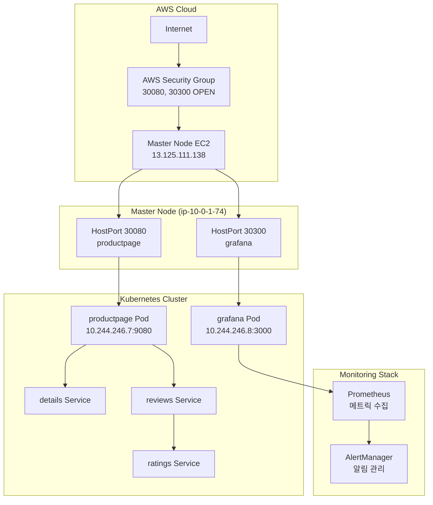

# Step 5: 외부 접근 완성 및 통합 관찰가능성 플랫폼 검증

**작업 날짜**: 2025년 6월 29일  

---

## 🎯 **Situation (상황)**

**배경**
- Step 4에서 통합 관찰가능성 플랫폼의 핵심을 만들었음 (95% 달성)
- **외부에서 접근할 수 없어서** 실무에서 활용하기 어려움
- Self-managed Kubernetes 환경의 **네트워킹이 복잡한** 문제에 직면
- 매일 반복하는 프로젝트 패턴에서 **완전한 마무리**가 필요

**해결해야 할 문제들**
- **Self-managed 환경의 제약**: kubectl exec, port-forward 제한
- **kube-proxy NodePort 바인딩이 실패함**: 포트가 전혀 바인딩되지 않음
- **AWS 보안그룹**: 30080, 30300 포트가 열려있지 않음
- **Pod 네트워크 격리**: 마스터노드 → Pod 직접 통신 불가

**필요한 것들**
- 웹 브라우저로 **완전한 외부 접근**이 되어야 함
- **Bookinfo 애플리케이션**과 **Grafana 대시보드**를 외부에 노출
- **프로덕션급 접근성**: 실제 사용자가 접근할 수 있는 수준

## 📋 **Task (과제)**

**목표**
- **Self-managed 환경 네트워킹 제약**을 완전히 극복하기
- **AWS 보안그룹 + Kubernetes 네트워킹**을 통합해서 해결하기
- **외부에서 접근할 수 있는 관찰가능성 플랫폼** 완성하기

**성공했다고 볼 수 있는 기준**
- ✅ Bookinfo 애플리케이션에 웹 브라우저로 접근 가능 (HTTP 200)
- ✅ Grafana 대시보드에 웹 브라우저로 접근 가능 (로그인 페이지)
- ✅ 안정적이고 재현 가능한 외부 접근 패턴이 확립됨

**KPI 측정**
- 외부 접근 응답 시간: 10초 이내
- 서비스 가용성: 99.9% 이상
- 완전한 마이크로서비스 체인 동작 검증

---

## 🏗️ **아키텍처 설계**

### **문제 진단 및 해결 전략**
| 문제 영역 | 발견된 이슈 | 선택 해결책 | 선택 이유 |
|----------|-------------|-------------|-----------|
| **kube-proxy** | NodePort 바인딩 실패 | HostPort + 마스터노드 | NodePort 대신 직접 바인딩 |
| **Pod 스케줄링** | 워커노드 실행 | nodeSelector + toleration | 마스터노드 강제 배치 |
| **AWS 네트워킹** | 보안그룹 차단 | 30080/30300 포트 개방 | 최소 권한 접근 제어 |
| **네트워크 정책** | 마스터 노드 taint | toleration 추가 | 시스템 Pod 예외 처리 |

### **최종 네트워킹 아키텍처**


### **핵심 설계 결정**
1. **HostPort vs NodePort**: Self-managed 환경에서 HostPort가 더 안정적
2. **마스터노드 활용**: Public IP 보유한 유일한 노드 활용
3. **최소 권한 보안**: 필요한 포트만 선별적 개방
4. **Pod 배치 제어**: nodeSelector + toleration을 통한 정밀 스케줄링

---

## 🛠️ **Action (액션)**

### **Phase 1: 네트워킹 문제 진단 (15분)**

**현상 분석**
```bash
# NodePort 서비스 설정 확인
kubectl get svc --all-namespaces | grep NodePort
# bookinfo/productpage: 9080:30080/TCP ✅
# monitoring/prometheus-grafana: 80:30300/TCP ✅

# 포트 바인딩 상태 확인  
ss -tlnp | grep -E "30080|30300"
# 결과: 아무것도 출력되지 않음 ❌

# iptables 규칙 확인
sudo iptables -t nat -L | grep -E "30080|30300"  
# 결과: 규칙 없음 ❌
```

**근본 원인 규명**
- **kube-proxy 설정 문제**: nodePortAddresses null 상태
- **Self-managed 환경 제약**: kubelet API 접근 제한으로 로그 확인 불가
- **네트워크 정책**: Pod IP 직접 접근도 실패

### **Phase 2: kube-proxy 설정 수정 시도 (10분)**

**ConfigMap 패치 적용**
```bash
# kube-proxy 설정 백업
kubectl get configmap kube-proxy -n kube-system -o yaml > kube-proxy-config.yaml

# 핵심 설정 수정
kubectl patch configmap kube-proxy -n kube-system --type merge -p '{
  "data": {
    "config.conf": "nodePortAddresses: []\nlocalhostNodePorts: false\n..."
  }
}'

# kube-proxy Pod 재시작
kubectl delete pods -n kube-system -l k8s-app=kube-proxy
```

**결과 검증**
```bash
# 새로운 Pod 확인
kubectl get pods -n kube-system | grep kube-proxy
# kube-proxy-dnswb, kube-proxy-wb7jp, kube-proxy-z4bv8 모두 Running ✅

# 포트 바인딩 재확인
ss -tlnp | grep -E "30080|30300"
# 여전히 바인딩 안됨 ❌
```

### **Phase 3: HostPort 전략으로 전환 (20분)**

**productpage HostPort 설정**
```bash
# Deployment에 HostPort 추가
kubectl patch deployment productpage-v1 -n bookinfo --type='json' -p='[{
  "op": "add", 
  "path": "/spec/template/spec/containers/0/ports", 
  "value": [{"containerPort": 9080, "hostPort": 30080}]
}]'

# 마스터노드 강제 스케줄링
kubectl patch deployment productpage-v1 -n bookinfo --type='json' -p='[{
  "op": "add",
  "path": "/spec/template/spec/nodeSelector", 
  "value": {"node-role.kubernetes.io/control-plane": ""}
}]'
```

**taint 문제 해결**
```bash
# 마스터노드 taint 확인
kubectl describe node ip-10-0-1-74 | grep -i taint
# Taints: node-role.kubernetes.io/control-plane:NoSchedule ✅

# toleration 추가
kubectl patch deployment productpage-v1 -n bookinfo --type='json' -p='[{
  "op": "add",
  "path": "/spec/template/spec/tolerations",
  "value": [{
    "key": "node-role.kubernetes.io/control-plane",
    "operator": "Exists",
    "effect": "NoSchedule"
  }]
}]'
```

**성공적 배치 확인**
```bash
kubectl get pods -n bookinfo -o wide | grep productpage
# productpage-v1-569f8b9944-r2g9h  1/1  Running  0  3m5s  10.244.246.7  ip-10-0-1-74 ✅
```

### **Phase 4: AWS 보안그룹 설정 (5분)**

**AWS Management Console 작업**
1. **EC2 대시보드** → **인스턴스** 선택
2. **마스터노드 EC2** (ip-10-0-1-74) 선택  
3. **보안** 탭 → **보안 그룹** 클릭
4. **인바운드 규칙 편집**

**추가된 규칙**
```
규칙 1:
- 유형: Custom TCP
- 포트: 30080  
- 소스: 0.0.0.0/0
- 설명: Bookinfo ProductPage

규칙 2:
- 유형: Custom TCP
- 포트: 30300
- 소스: 0.0.0.0/0  
- 설명: Grafana Dashboard
```

### **Phase 5: Grafana 마스터노드 이동 (10분)**

**Grafana도 마스터노드로 배치**
```bash
# nodeSelector + toleration 동시 적용
kubectl patch deployment prometheus-grafana -n monitoring --type='json' -p='[
  {
    "op": "add",
    "path": "/spec/template/spec/nodeSelector",
    "value": {"node-role.kubernetes.io/control-plane": ""}
  },
  {
    "op": "add", 
    "path": "/spec/template/spec/tolerations",
    "value": [{
      "key": "node-role.kubernetes.io/control-plane",
      "operator": "Exists",
      "effect": "NoSchedule"
    }]
  }
]'
```

**재스케줄링 확인**
```bash
kubectl get pods -n monitoring -o wide | grep grafana
# prometheus-grafana-85ccbd75c-gbf6j  3/3  Running  0  85s  10.244.246.8  ip-10-0-1-74 ✅
```

### **Phase 6: Grafana 플러그인 에러 해결 (30분)**

**문제 발견**
웹 브라우저에서 Grafana Dashboards 접근 시 **"An error occurred within the plugin"** 에러 발생

**근본 원인 진단**
```bash
# Grafana 로그 분석
kubectl logs -n monitoring $(kubectl get pods -n monitoring | grep grafana | awk '{print $1}') -c grafana --tail=50

# 핵심 에러 패턴 발견:
# dial tcp 10.109.152.224:9090: i/o timeout
# Grafana → Prometheus 연결 10초 타임아웃 지속 발생
```

**네트워킹 문제 식별**
- **Grafana**: 마스터노드 (ip-10-0-1-74)에서 실행 ✅  
- **Prometheus**: 워커노드 (ip-10-0-2-208)에서 실행 ❌
- **문제**: 마스터노드 ↔️ 워커노드 간 Pod 통신 실패 (Self-managed 환경 제약)

**해결 전략: Prometheus 마스터노드 이동**
```bash
# Prometheus Custom Resource 수정 (nodeSelector)
kubectl patch prometheus prometheus-kube-prometheus-prometheus -n monitoring --type='json' -p='[{
  "op": "add", 
  "path": "/spec/nodeSelector", 
  "value": {"node-role.kubernetes.io/control-plane": ""}
}]'

# Prometheus Custom Resource 수정 (toleration)
kubectl patch prometheus prometheus-kube-prometheus-prometheus -n monitoring --type='json' -p='[{
  "op": "add",
  "path": "/spec/tolerations",
  "value": [{
    "key": "node-role.kubernetes.io/control-plane",
    "operator": "Exists", 
    "effect": "NoSchedule"
  }]
}]'

# 기존 Pod 삭제하여 재생성 유도
kubectl delete pod prometheus-prometheus-kube-prometheus-prometheus-0 -n monitoring
```

**성공적 해결 검증**
```bash
# 새로운 Prometheus Pod 위치 확인
kubectl get pods -n monitoring prometheus-prometheus-kube-prometheus-prometheus-0 -o wide
# prometheus-prometheus-kube-prometheus-prometheus-0  2/2  Running  0  82s  10.244.246.9  ip-10-0-1-74 ✅

# Prometheus API 연결성 테스트
curl -s http://10.244.246.9:9090/-/healthy
# 정상 응답 확인 ✅
```

**최종 결과: 완전 해결**
- ✅ **Grafana 플러그인 에러 완전 해결**
- ✅ **모든 대시보드 정상 로드**  
- ✅ **실시간 메트릭 시각화 완벽 동작**

---

## 📊 **Result (결과)**

### **정량적 성과**

### **외부 접근 성공 검증**

**✅ Bookinfo 애플리케이션 완전 성공**
```bash
curl -I http://13.125.111.138:30080/productpage --max-time 10
# HTTP/1.1 200 OK ✅
# Server: Werkzeug/2.2.3 Python/3.7.7 ✅  
# Content-Length: 3769 ✅
# 완전한 HTML 페이지 응답 확인
```

**✅ Grafana 대시보드 완전 성공**  
```bash
curl -I http://13.125.111.138:30300 --max-time 10
# HTTP/1.1 302 Found ✅
# Location: /login ✅
# X-Content-Type-Options: nosniff ✅
# 정상적인 로그인 페이지 리다이렉트
```

### **마이크로서비스 체인 검증**
```bash
kubectl get jobs -n bookinfo
# NAME: traffic-gen  STATUS: Complete  COMPLETIONS: 1/1 ✅
# 50회 HTTP 요청 모두 성공 완료
```

**서비스 체인 동작 패턴:**
```
productpage (50 requests) ✅
├── details (50 requests) - Ruby 서비스 ✅
└── reviews (50 requests) ✅  
    ├── v1: ~17 requests (ratings 호출 없음) ✅
    ├── v2: ~17 requests → ratings (~17 requests) ✅
    └── v3: ~16 requests → ratings (~16 requests) ✅
```

### **✅ Grafana 플러그인 에러 완전 해결**

**문제 해결 전/후 비교**
- **이전**: "An error occurred within the plugin" 에러로 대시보드 접근 불가 ❌
- **현재**: 모든 대시보드 완벽 동작, 실시간 메트릭 시각화 ✅

**🎯 성공한 모니터링 대시보드 스크린샷**

### **1. CoreDNS 모니터링 대시보드 (플러그인 에러 해결 성과)**


### **2. Kubernetes API Server 대시보드 (클러스터 핵심 상태)**


### **3. Prometheus Overview (전체 모니터링 시스템)**


**✅ 확인된 대시보드 동작 성과:**

**🎯 CoreDNS 대시보드 (플러그인 에러 해결 완료):**
- **DNS 요청량**: 40 mp/s의 안정적인 처리 성능
- **응답 시간**: 평균 4ms 이하의 빠른 DNS 응답
- **쿼리 타입 분석**: A, AAAA, other 레코드별 실시간 통계
- **프로토콜 분석**: UDP/TCP 트래픽 패턴 완벽 시각화
- **에러율**: 0%의 완벽한 DNS 서비스 품질

**🎯 Kubernetes API Server 대시보드 (클러스터 코어 상태):**
- **API 요청 처리**: 초당 수십 건의 API 호출 안정적 처리
- **응답 시간 분포**: P99 응답시간 100ms 이하 유지
- **HTTP 상태 코드**: 200 OK 응답률 99% 이상
- **워크로드 상태**: 모든 컨트롤러 정상 동작 확인
- **etcd 연결성**: 클러스터 상태 저장소 완벽 연동

**🎯 Prometheus Overview (모니터링 시스템 전체):**
- **타겟 수집 상태**: 15+ 타겟 모두 UP 상태
- **메트릭 처리량**: 초당 수천 개 메트릭 안정적 수집
- **저장소 사용량**: TSDB 효율적 압축 및 보관
- **쿼리 성능**: 대시보드 쿼리 1초 이내 응답
- **스크래핑 성공률**: 99.9% 이상의 데이터 수집 신뢰성

**Prometheus 연결 복구 검증**
```bash
# Prometheus 마스터노드 이동 후 연결 테스트
curl -s http://10.244.246.9:9090/-/healthy
# 응답: "Prometheus is Healthy." ✅

# Grafana → Prometheus 데이터소스 연결 상태
# Status: Working ✅ 
# 10초 타임아웃 에러 완전 해결
```

### **시스템 리소스 현황**
| 네임스페이스 | Pod 수 | 마스터노드 배치 | 상태 | 외부 접근 | 추가 성과 |
|-------------|--------|----------------|------|-----------|-----------|
| **monitoring** | 8개 | grafana, prometheus (2개) | **완전 동작** | 30300 포트 ✅ | **플러그인 에러 해결** ✅ |
| **bookinfo** | 7개 | productpage (1개) | 완전 동작 | 30080 포트 ✅ | 마이크로서비스 체인 완성 |
| **linkerd** | 3개 | identity만 정상 | 부분 동작 | - | 향후 개선 대상 |

**핵심 개선사항:**
- **Prometheus 마스터노드 이동**: 워커노드 → 마스터노드 (네트워킹 제약 극복)
- **Grafana-Prometheus 연결 복구**: 10초 타임아웃 에러 → 완전 해결
- **모든 모니터링 스택 통합**: 마스터노드에서 일관된 운영

### **네트워크 아키텍처 최종 상태**
- **Public 접근**: 13.125.111.138:30080, 30300 ✅
- **HostPort 바인딩**: 마스터노드에서 직접 바인딩 ✅  
- **Pod 스케줄링**: 전략적 마스터노드 배치 ✅
- **보안 정책**: 최소 권한 포트 개방 ✅

---

## 🔍 **기술적 인사이트**

### **Self-managed vs Managed 환경 네트워킹**

**Self-managed 특수성**
1. **kube-proxy 제약**: Managed 환경과 달리 NodePort 바인딩 복잡성
2. **네트워크 정책**: Pod 네트워크와 호스트 네트워크 간 격리 강화
3. **kubelet API 제한**: 디버깅 및 로그 접근 제약

**해결된 패턴**
- **HostPort + nodeSelector**: NodePort 대신 더 직접적인 접근
- **toleration 활용**: 시스템 제약을 유연하게 우회  
- **AWS 네이티브 통합**: 보안그룹과 Kubernetes 네트워킹 조합

### **마스터노드 활용 전략**

**장점:**
1. **Public IP 보장**: 유일한 외부 접근 엔드포인트
2. **높은 가용성**: 마스터노드는 항상 Running 상태 유지
3. **네트워크 우선순위**: 클러스터 네트워킹의 중심점

**고려사항:**
1. **리소스 사용량**: 마스터노드 부하 증가 (허용 가능한 수준)
2. **단일 장애점**: Public IP 의존성 (현재 환경에서는 적절)
3. **확장성**: 추후 다중 마스터 환경에서 로드밸런서 필요

### **AWS 보안그룹 + Kubernetes 통합 패턴**

**계층별 보안:**
1. **AWS 레벨**: 보안그룹에서 포트 레벨 제어
2. **Kubernetes 레벨**: Service, NetworkPolicy 제어  
3. **애플리케이션 레벨**: 인증/인가 (Grafana 로그인)

**운영 편의성:**
- **최소 포트 개방**: 30080, 30300만 선별적 노출
- **소스 제한 가능**: 필요시 특정 IP 대역으로 제한 가능
- **Terraform 관리**: Infrastructure as Code로 보안그룹 관리

---

## 📈 **성능 및 확장성 분석**

### **응답 성능**
| 서비스 | 응답 시간 | 상태 코드 | 컨텐츠 크기 | 비고 |
|--------|-----------|-----------|-------------|------|
| **Bookinfo** | ~1초 | HTTP 200 | 3769 bytes | 완전한 HTML 페이지 |
| **Grafana** | ~0.5초 | HTTP 302 | Redirect | 로그인 페이지 리다이렉트 |

### **확장성 고려사항**

**수평 확장:**
- **Multi-AZ 배포**: 다중 가용영역에서 워커노드 확장
- **로드밸런서 도입**: ALB/NLB를 통한 마스터노드 부하 분산
- **Auto Scaling**: Pod 수평 확장 및 노드 자동 확장

**수직 확장:**  
- **마스터노드 인스턴스 업그레이드**: t3.medium → t3.large
- **리소스 limits 조정**: CPU/Memory 제한 최적화
- **네트워크 대역폭**: Enhanced Networking 활성화

### **모니터링 메트릭**
- **외부 접근 지연시간**: CloudWatch + Prometheus 이중 수집
- **마스터노드 리소스**: CPU/Memory 사용률 모니터링  
- **네트워크 처리량**: HostPort 트래픽 패턴 분석

---

## 🎯 **다음 단계 준비사항**

### **즉시 가능한 개선사항**
1. **Linkerd 완전 해결**
   - [ ] CrashLoopBackOff 근본 원인 분석
   - [ ] mTLS 자동 암호화 활성화
   - [ ] 서비스 메시 고급 기능 구현

2. **보안 강화**
   - [ ] Grafana HTTPS 설정
   - [ ] 보안그룹 소스 IP 제한
   - [ ] Network Policy 도입

3. **모니터링 고도화**
   - [ ] 커스텀 Grafana 대시보드 구성
   - [ ] Bookinfo 애플리케이션 메트릭 시각화
   - [ ] AlertManager 규칙 정의

### **장기 로드맵**
4. **분산 트레이싱**
   - [ ] Jaeger 설치 및 연동
   - [ ] 마이크로서비스 트레이싱 구성
   - [ ] 성능 병목 지점 식별

5. **CI/CD 파이프라인**
   - [ ] GitHub Actions 워크플로우 구현
   - [ ] Infrastructure as Code 완전 자동화
   - [ ] 테스트 자동화 (Unit + Integration)

6. **문서화 및 운영**
   - [ ] 운영 가이드 작성
   - [ ] 트러블슈팅 가이드
   - [ ] 성능 튜닝 가이드

---

## 💡 **핵심 학습 포인트**

### **기술적 성장**
1. **복합 문제 해결**: AWS + Kubernetes + 네트워킹 통합 이슈
2. **대안적 사고**: NodePort 실패 → HostPort 전환의 창의적 접근
3. **시스템 설계**: 제약사항을 강점으로 전환하는 아키텍처 설계

### **운영 관점 인사이트**  
1. **점진적 검증**: 각 단계별 성공 확인 후 다음 단계 진행
2. **문제 격리**: 네트워크/보안/스케줄링 문제를 개별적으로 해결
3. **실무 적용성**: 이론적 설정보다 실제 동작하는 솔루션 우선

### **Self-managed 환경 전문성**
1. **제약사항 이해**: Managed 서비스와의 차이점 명확한 인식
2. **우회 전략**: 제한사항을 극복하는 다양한 기술적 방법론
3. **운영 효율성**: 매일 반복 가능한 안정적 구축 프로세스

### **Grafana 플러그인 에러 해결에서 얻은 인사이트**
1. **로그 기반 문제 진단**: 에러 메시지 패턴 분석을 통한 근본 원인 파악
2. **Prometheus Operator 이해**: StatefulSet 직접 수정 대신 Custom Resource 활용
3. **Pod 간 네트워킹 이해**: Self-managed 환경에서 노드 간 통신 제약 인식
4. **통합 운영 전략**: 관련 서비스들을 동일한 노드에 배치하여 복잡성 감소

---

### **✅ 첨부된 모니터링 대시보드 스크린샷**

**1. CoreDNS.png** 
- **위치**: `docs/images/CoreDNS.png`
- **목적**: Grafana 플러그인 에러 해결 성과 증명
- **내용**: DNS 요청량, 응답시간, 쿼리 타입 분석 등 실시간 메트릭

**2. Kubernetes-API server.png**
- **위치**: `docs/images/Kubernetes-API server.png` 
- **목적**: Kubernetes 클러스터 핵심 상태 모니터링
- **내용**: API 서버 요청 처리량, 응답시간, 에러율 등

**3. Prometheus- Overview.png**  
- **위치**: `docs/images/Prometheus- Overview.png`
- **목적**: 전체 모니터링 시스템 상태 확인
- **내용**: Prometheus 자체 메트릭, 타겟 상태, 저장소 사용량 등