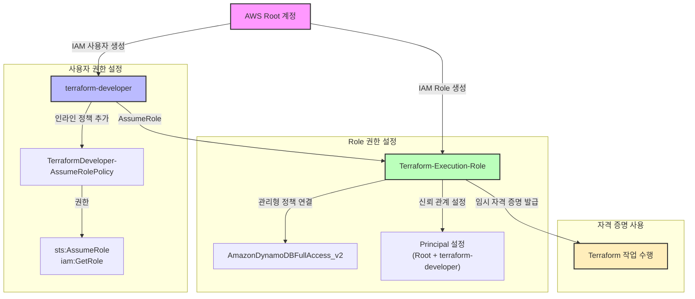

# AWS 자격 증명 설정 가이드

## IAM 구성 다이어그램

## 자격 증명 설정 프로세스
1. AWS Root 계정에서 시작
2. terraform-developer IAM 사용자 생성
3. Terraform-Execution-Role IAM Role 생성
4. 사용자에게 Role 수임을 위한 정책 부여
5. Role에 필요한 권한 정책 연결
6. 신뢰 관계를 통한 Role 수임 권한 설정
7. 임시 자격 증명을 사용한 Terraform 작업 수행 