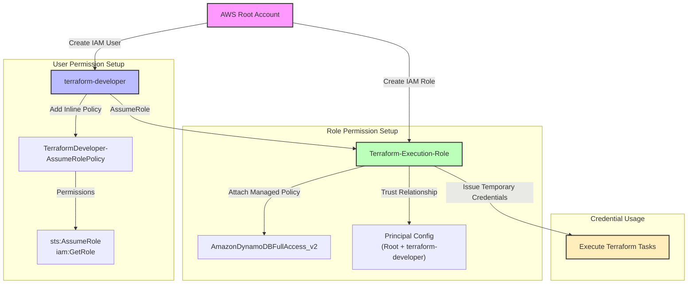

# AWS Credentials Setup Guide

## IAM Configuration Diagram

## Credential Setup Process
1. Start with AWS Root Account
2. Create terraform-developer IAM User
3. Create Terraform-Execution-Role IAM Role
4. Grant Role assumption policy to User
5. Attach required permission policies to Role
6. Configure trust relationship for Role assumption
7. Execute Terraform tasks using temporary credentials 